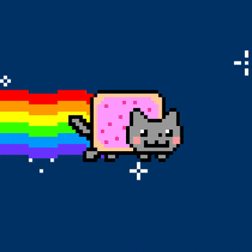

<a href="https://git.io/typing-svg">
  <!--img src="https://readme-typing-svg.demolab.com?font=Fira+Code&size=45&duration=3000&pause=800&color=4D77F7FF&center=true&random=false&width=435&height=80&lines=Hi+there%F0%9F%91%8B;I+am+Leo!" alt="Hi there%F0%9F%91%8B" /-->
  <!--img src="https://readme-typing-svg.demolab.com?font=Fira+Code&pause=1000&size=45&color=F7B316&width=450&center=true&height=80&lines=Welcome%2C+stranger!" alt="Welcome, stranger!" /-->
  
</a>

  

<h2>About me🎈</h2>
I am a passionate programmer with a wide range of interests, from data science and machine learning to low-level programming and game development. I also have a background in Competitive programming and love to tackle challenging problems.

<!-- gif source: https://pixelartjourney.tumblr.com/post/716292571041792000/summer-rain-->

<!--
  
-->

<h2>🔥Technologies & Instruments⚒️</h2>

  

<h2>🌈Stats🎄</h2>

<!--h2>Languages Spoken🌈</h2>
<h3>Russian(native)</h3>
<h3>English</h3>

<a href="https://git.io/typing-svg">

<h2 align = "right">📫Get In Touch📭</h2>

  
  
  
  

